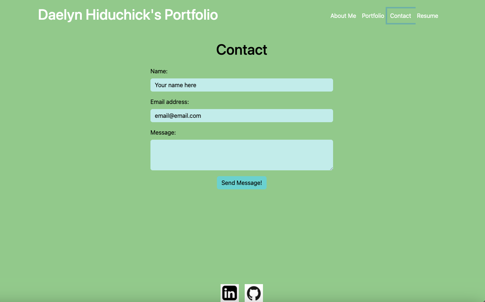

# Hiduchick-React-Portfolio

## Deployed Application 

[Daelyn Hiduchick's Portolio Deployed on Netlfiy](https://daelynhiduchick.netlify.app)

## Description

This React portfolio application, meticulously crafted with Bootstrap styling, stands as a versatile platform meticulously crafted to encapsulate my professional journey and accomplishments comprehensively. From the meticulously organized sections such as "About Me," "Projects," "Contact," to the detailed "Resume" segment, every aspect is meticulously designed to provide visitors with an immersive experience.

Within the "About Me" section, I delve into my background, passions, and aspirations, offering visitors a glimpse into the person behind the projects. The "Projects" segment serves as a showcase of my work, with each project meticulously detailed to highlight the skills and technologies utilized. Through the "Contact" section, I provide various means of communication, ensuring that visitors can easily reach out for collaboration or inquiries.

Furthermore, the inclusion of a detailed "Resume" section allows for a comprehensive overview of my professional experience, education, and skills. This portfolio, with its intuitive navigation and visually appealing design, offers a seamless browsing experience. By leveraging its customizable features, I can tailor the content to resonate with diverse audiences, leaving a lasting impression on potential clients or employers.

In essence, this dynamic and comprehensive portfolio not only serves as a testament to my skills and accomplishments but also as a powerful tool for building meaningful connections and opportunities in the digital landscape.

## Portfolio Images

## Author

* Made with ˖⁺‧₊˚♡˚₊‧⁺˖ by Daelyn Hiduchick